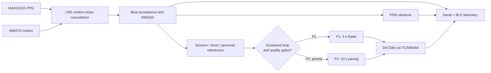
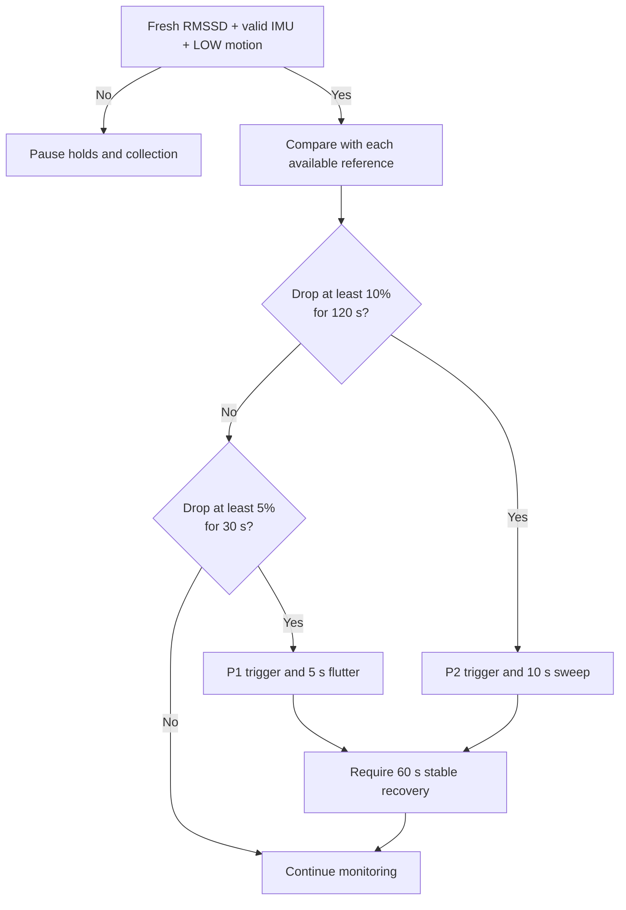

# SUTRA firmware guide

SUTRA is an ESP32-S3 wearable prototype that derives heart-rate variability
(RMSSD) from MAX30101 PPG data, uses BMI270 motion data to qualify that signal,
and can present local haptic interventions. BLE exposes the same labelled status
groups as the serial monitor. The firmware is a prototype: it does not diagnose
stress, and PDR is context rather than a trigger.

## Main features

| Feature | What it does | Important boundary |
|---|---|---|
| PPG and LMS beat processing | Cleans PPG with a motion-informed LMS path, detects usable beats, and calculates RMSSD. | Rejected, stale, or no-contact data cannot qualify a trigger. |
| Three RMSSD references | Uses a startup session median, an adapting five-minute short reference, and a persisted seven-session median. | Seven startup sessions are a prototype stand-in for daily measurements. |
| P1/P2 episode logic | Detects sustained RMSSD drops, prioritizes P2, and requires stable recovery before rearming. | P1/P2 are research interventions, not clinical conclusions. |
| Haptic patterns | Generates a 5 s random P1 flutter and a 10 s paced P2 sweep at a 40% output cap. | Firmware currently drives one DA7280/LRA on mux channel 0; the library is three-motor capable. |
| PDR observer | Estimates respiratory-rate context from RIAV/RIFV, maintains a resting baseline, and summarizes P2 rate match. | It never gates, changes, or triggers P1/P2. |
| BLE telemetry | Provides grouped UTF-8 read fields plus a notification stream that mirrors serial output. | Notifications are best effort, not a beat-by-beat recording. |

## System flow



## RMSSD intervention decision flow



P2 wins when both conditions are reached together. An active P2 cannot be
interrupted by P1; a P2 can preempt P1.

## P2 pacing chart

The following timeline is the three-logical-motor pattern. In the current
single-motor hardware configuration, only the left/Motor 1 spans are actuated.

```mermaid
gantt
    title One 10-second P2 breathing cycle
    dateFormat  X
    axisFormat %Ls
    section Left / Motor 1
    Inhale ramp 10–50% : 0, 1300
    Exhale ramp 30–0% : 6000, 4000
    section Centre / Motor 2
    Hold then ease 60–30% : 2600, 3400
    section Right / Motor 3
    Inhale ramp 10–50% : 1300, 1300
```



## Detailed documents

- [Haptic protocols](haptic-protocols.md) — wiring scope, patterns, output scaling, and faults.
- [RMSSD references](rmssd-references.md) — baselines, trigger holds, recovery, and persistence.
- [PDR observer](pdr-observer.md) — respiration estimation and its non-gating role.
- [BLE telemetry](ble-telemetry.md) — service UUIDs, grouped fields, and notification behaviour.

## Build and test

```text
pio run -e seeed_xiao_esp32s3
pio test -c platformio-test.ini -e native
```

The host tests verify deterministic algorithms and simulated I2C behavior.
Hardware testing is still required for sensor accuracy, vibration strength,
timing under load, BLE performance, and safe power behavior.
