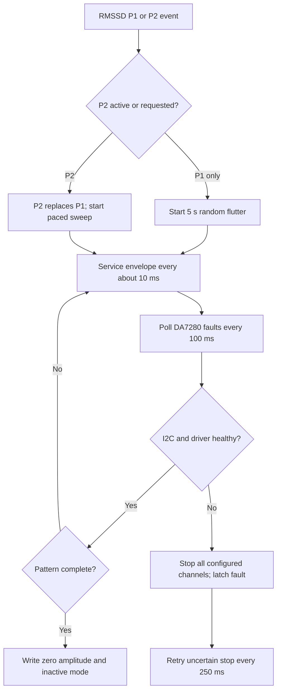

# Haptic actuation

The PoC uses the existing RMSSD P1/P2 events. It does not invent a State Alpha
classifier or confidence score. P1 runs for five seconds; P2 runs for one complete
ten-second breathing cycle for testing. P2 replaces an active P1; a P1 request
cannot interrupt P2.

## Current hardware scope

The pattern library and transport are designed for up to three logical motors,
but the checked-in firmware currently enables **one** SmartElex DA7280 module:
Motor 1 on TCA9548A channel 0. The left/centre/right descriptions below document
the three-channel pattern design and its host tests; they are not a claim that
the production configuration currently drives channels 1 and 2. With the current
`motorCount = 1` configuration, only the Motor 1 portions of P1 and P2 are sent.

Adding the remaining modules requires wiring them to distinct mux channels and
changing the firmware configuration deliberately. It is not enabled merely by
using the three-motor pattern generator.

The RMSSD drop thresholds remain 5% for P1 and 10% for P2, with trigger holds
of 30 seconds and 120 seconds respectively. These playback durations include
the existing pattern's quiet intervals. The reusable pattern generator supports
independent P1 taps across all three positions and the P2 left/right/centre sweep
below. The currently enabled single module receives only its Motor 1 frames.

The current single-motor firmware sets `ArrayConfig::outputScalePercent = 40`.
It scales the original 0–100% envelope into 0–40%, preserving ramps and pauses
instead of forcing a fixed ON intensity. P1's original 90% taps become 36%;
P2's 10–50% ramps become 4–20%, its 60% hold becomes 24%, and its 30–0%
exhale becomes 12–0%. The original envelopes are described below.
Percentages are converted to raw 0–127 DRO codes with rounding: a 40% full-scale
command is code 51, not the reference sketch's raw code 40. Phase timing, fault
handling and motor electrical settings are unchanged. The library default of
100 preserves the original envelope; 0 mutes it.

## Hardware mapping

The existing XIAO ESP32S3 I2C bus uses GPIO 5 for SDA and GPIO 6 for SCL at 400 kHz.
The MAX30101 and BMI270 remain on that root bus. The TCA9548A address is `0x70`.

| Logical motor | Position | Mux channel | DA7280 address | Enabled now |
|---|---|---|---|---|
| Motor 1 | Left | 0 | `0x4A` | Yes |
| Motor 2 | Center / P6 | 1 | `0x4A` | No — design/test mapping |
| Motor 3 | Right | 2 | `0x4A` | No — design/test mapping |

The driver selects exactly one channel for each addressed motor, checks I2C
results, and deselects all channels before returning to the sensor code. Each
DA7280 continues its amplitude independently after deselection, allowing both
outer motors to run during exhale. These are three separate driver modules;
the mux does not provide motor power or directly drive an LRA.

This setup targets the onboard LRA of the supplied SmartElex module. It retains
the existing/default DA7280 actuator voltage, current, impedance, and frequency
registers; the SmartElex manual does not publish a motor-specific replacement
profile. It does not substitute SparkFun's `defaultMotor()` values. This is not
a calibration of the attached motors. If the onboard motors have been replaced,
their electrical parameters must be configured from the replacement datasheet.

Amplitude is sent through DA7280 direct-register-override mode, with LRA BEMF
sensing, frequency tracking, acceleration, and rapid stopping enabled. The
0–100% envelope is mapped to the supported nonnegative 0–127 command range.
Percentages describe commanded amplitude relative to the configured driver
full scale, not measured mechanical strength. Driver supply-limit warnings are
reported because delivered strength can be lower than requested.

## P1: chaotic staccato flutter

- 90% amplitude on each motor's active taps.
- Each motor has its own staggered start and independent tap/gap timer.
- Nominal tap lengths vary from 60 to 250 ms; gaps vary from 50 to 450 ms.
- Taps may overlap across motors, without a common periodic beat.
- A fresh ESP32 random seed is used for each five-second intervention.
- All outputs stop at completion. A final tap is shortened only if it can still
  meet the 60 ms minimum; otherwise that tap is omitted.

## P2: resonant pacing sweep

| Time within each cycle | Motor 1 | Motor 2 | Motor 3 |
|---|---|---|---|
| 0–1.3 s | 10% → 50% | Off | Off |
| 1.3–2.6 s | Off | Off | 10% → 50% |
| 2.6–4.0 s | Off | 60% | Off |
| 4.0–6.0 s | Off | 60% → 30% | Off |
| 6.0–10.0 s | 30% → 0% | Off | 30% → 0% |

Ramps are linear in commanded amplitude. Cycle timing is derived from elapsed
time, so late loop calls do not accumulate breathing-cycle drift. The firmware
services envelopes about every 10 ms and also between serial report lines.
I2C transfers and loop scheduling introduce timing/quantization error; this is
not a hardware-timed waveform generator. The left/center/right mounting produces
the intended spatial cue; individual LRAs are not commanded to move physically
toward or away from P6.

## Runtime status and faults

The transport uses TCA9548A channel selection to address one identical-address
DA7280 at a time. A previously addressed driver keeps its amplitude after mux
disconnect, so multi-motor envelopes can overlap when configured.

Before sensor initialization, startup runs `BOOT_TEST`: all three logical motors
on mux channels 0–2 receive the 40%-capped command for ten seconds. Confirm each
motor physically by touch. The test uses a separate three-motor array; normal
P1/P2 playback remains configured for Motor 1 only. If a test branch is missing
or faults, the failure is logged and sensor initialization continues.

While a protocol is playing, frames are serviced about every 10 ms and driver
fault registers are polled every 100 ms. At normal completion the firmware sends
a stop command and logs `[HAPTIC] protocol complete`. I2C failures and driver
faults stop the sequence; shutdown is retried every 250 ms if its acknowledgement
is uncertain. `FAULT_STOP_PENDING` means the firmware cannot yet confirm a stop.
Haptic state is reported as `OFF`, `P1_FLUTTER`, `P2_SWEEP`, `FAULT`, or
`FAULT_STOP_PENDING`.

P2 has priority when P1 and P2 trigger together, and P2 immediately replaces an
active P1. A P1 request never interrupts P2. Reference collection/recovery sees
the whole intervention as active, including P1 gaps. Haptics remain disabled
after a latched driver fault until reboot. Software can confirm commands and I2C
acknowledgements, not physical vibration; confirm motor response by touch. The
I2C transfer timeout is bounded at 10 ms.

## Files and validation

- `lib/HapticPatterns`: motor envelope timing, durations and gap constants.
- `lib/HapticArray`: mux mapping and DA7280 register transport.
- `src/HapticWireBus.h`: Arduino Wire adapter.
- `src/main.cpp`: RMSSD triggers, hardware setup, playback servicing, and status.
- `test/test_haptics`: phase boundaries, independent bursts, rollover, priority,
  three-channel routing, mux isolation, amplitude scaling, and fault/shutdown
  behavior.

Build: `pio run -e seeed_xiao_esp32s3`

Host tests: `pio test -c platformio-test.ini -e native`

Host tests use simulated time and I2C registers. Actual motor amplitude, mounting,
physical timing, and sensor quality during vibration require a hardware run.

## Hardware references

- [SmartElex module manual](https://robu.in/wp-content/uploads/2024/12/SmartElex-Haptic-Motor-Driver-%E2%80%93-DA7280-Manual.pdf)
- [Renesas DA7280 datasheet, sections 5.6 and 6.2](https://www.renesas.com/en/document/dst/da7280-datasheet)
- [TI TCA9548A datasheet](https://www.ti.com/lit/ds/symlink/tca9548a.pdf)
