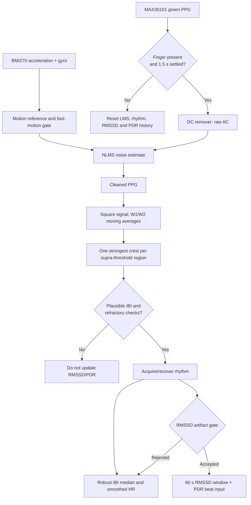

# LMS and Elgendi beat-detection pipeline

This document describes the PPG path used for cleaned heart-rate, IBI, RMSSD,
and PDR inputs. It is a prototype signal-processing pipeline, not a medical
measurement or an arrhythmia detector.

## What it does

The MAX30101 green-channel signal is cleaned with a motion-informed normalized
LMS (NLMS) filter. The cleaned signal then enters an Elgendi-style moving-average
detector that selects one strongest crest per pulse region. Accepted intervals
feed HR and, after stricter artifact checks, RMSSD and PDR.



## Algorithms and features

| Stage | Algorithm | Purpose |
|---|---|---|
| Contact gate | Green baseline threshold plus 1.5 s settling period | Prevents old filter/rhythm state being reused after finger changes. |
| Motion reference | High-pass-like residual of acceleration magnitude; gyro and acceleration variability | Supplies a reference for motion-noise cancellation and classifies LOW/MODERATE/HIGH motion. |
| LMS filter | NLMS adaptive subtraction with bounded update and leakage | Reduces PPG components correlated with motion without adapting to quiet IMU noise. |
| Beat detector | Elgendi-style W1/W2 moving averages of squared cleaned PPG | Forms a dynamic threshold and chooses one crest per pulse region, reducing notch double-counts. |
| Rhythm acquisition | Four initial plausible intervals; stale recovery needs four consistent candidates | Avoids publishing HR from a transient first interval and avoids stitching uncertain rhythm segments into HRV. |
| RMSSD gate | 300-2000 ms range plus <=20% jump from the last accepted IBI after three seed beats | Keeps double/missed optical beats from dominating squared successive differences. |
| Stability gates | 20 one-second LMS-weight samples and 20 one-second RMSSD samples | Prevents baselines from using a drifting filter or unsettled RMSSD. |

## Important variables and current values

| Variable | Current value | Role |
|---|---:|---|
| `SAMPLE_RATE_HZ` | 400 Hz | MAX30101 configured sample rate. |
| `sampleAverage` | 2 | MAX30101 FIFO averaging configuration. |
| `W1_SAMPLES` / `W2_SAMPLES` | 11 / 67 | Locked Elgendi windows for the measured approximately 100 Hz LMS stream: about 111 ms and 667 ms. |
| `ELGENDI_BETA` | 0.02 | Multiplier for the dynamic beat-threshold offset. |
| `DC_REMOVER_ALPHA` | 0.95 | Slow PPG baseline tracker used to derive raw AC. |
| `LMS_MU` | 0.003 | NLMS adaptation gain. |
| `LMS_WEIGHT_MIN/MAX` | -25 / 25 | Bounds on adaptive filter weight. |
| `LMS_LEAK_ACTIVE/REST` | 0.0002 / 0.0050 | Weight decay during motion and rest; faster rest decay limits drift. |
| `MOTION_REF_NOISE_FLOOR` | 0.004 g | Additional minimum motion-reference magnitude for adaptation. |
| Fast-motion thresholds | accel 0.006/0.004 g; gyro 2.0/1.2 deg/s | ON/OFF hysteresis thresholds for LMS adaptation. |
| Fast-motion holds | 200 ms ON / 600 ms OFF | Debounces the LMS adaptation gate. |
| `LMS_REFRACTORY_MS` | 300 ms | Supports heart rates up to 200 bpm without a structural 150 bpm cap. |
| IBI range | 300-1800 ms | Acceptance range for the LMS beat path. |
| `RMSSD_ARTIFACT_MAX_PCT` | 20% | Maximum change from previous accepted RMSSD interval after seeding. |
| `STALE_RESEED_MS` | 3000 ms | HR freshness timeout and stale-rhythm recovery boundary. |

## LMS adaptation flow

```mermaid
flowchart LR
    A[Acceleration magnitude residual] --> B[Scale g to milli-g]
    C[Cleaned PPG error, bounded to +/-80] --> D{Fast motion gate ON,<br/>valid IMU, and reference >= 0.004 g?}
    B --> D
    D -- Yes --> E[NLMS update: mu * error * reference / (1 + reference squared)]
    E --> F[Clamp weight to -25...25]
    F --> G[Apply active leakage 0.0002]
    D -- No --> H[No adaptation]
    H --> I[Apply rest leakage 0.0050]
    G --> J[Subtract weight * motion reference from raw AC]
    I --> J
```

The adaptation gate is intentionally independent of the slower user-visible
motion state. It responds quickly to genuine movement but decays learned
cancellation at rest so residual IMU noise does not slowly corrupt the PPG.

## Output and limitations

`LMS` telemetry reports cleaned HR, median IBI, RMSSD, convergence, stability,
and freshness. HR can be valid while an IBI is excluded from RMSSD/PDR; this is
intentional because HR tolerates smoothing whereas HRV needs trustworthy
individual intervals. PDR uses only intervals that pass the RMSSD artifact gate.

The locked W1/W2 settings are tuned to the present hardware configuration. If
the effective stream rate, optical placement, LED setting, or FIFO setup changes,
revalidate the detector before changing these constants.
